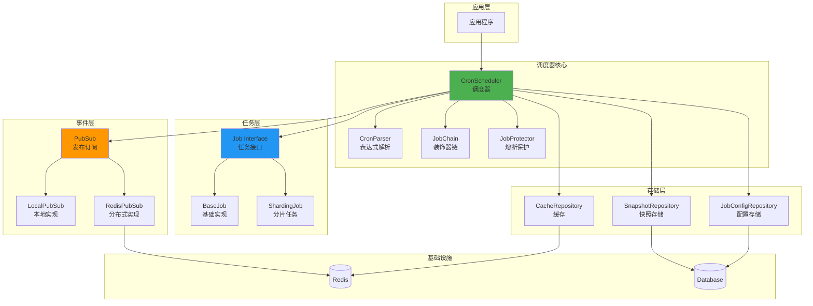
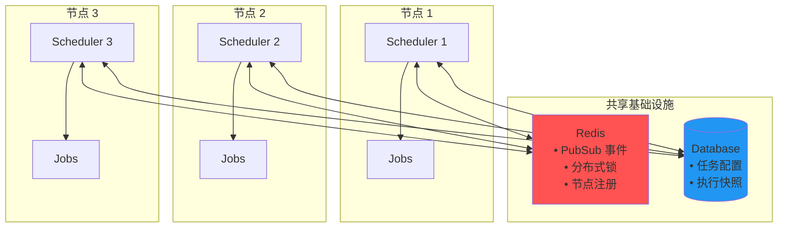
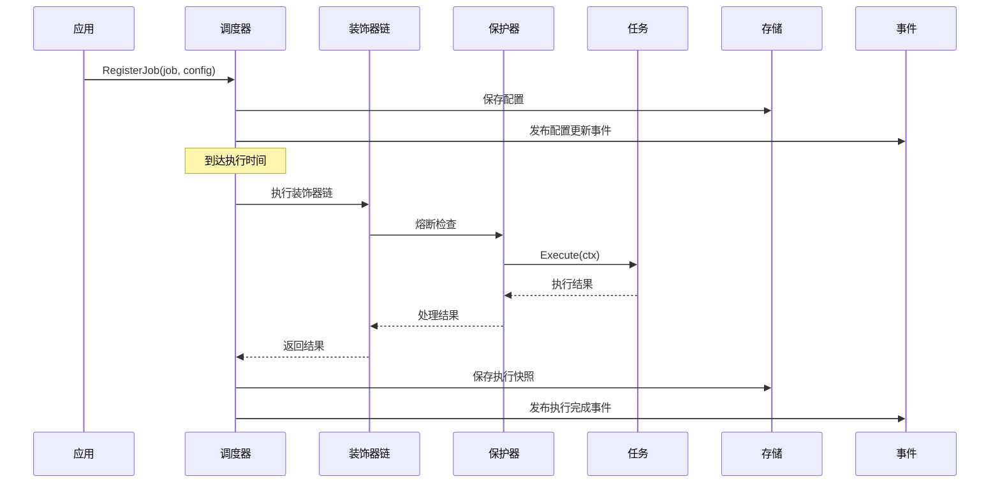
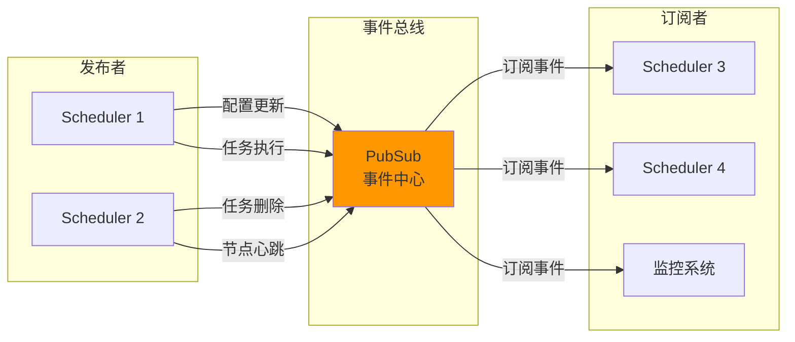
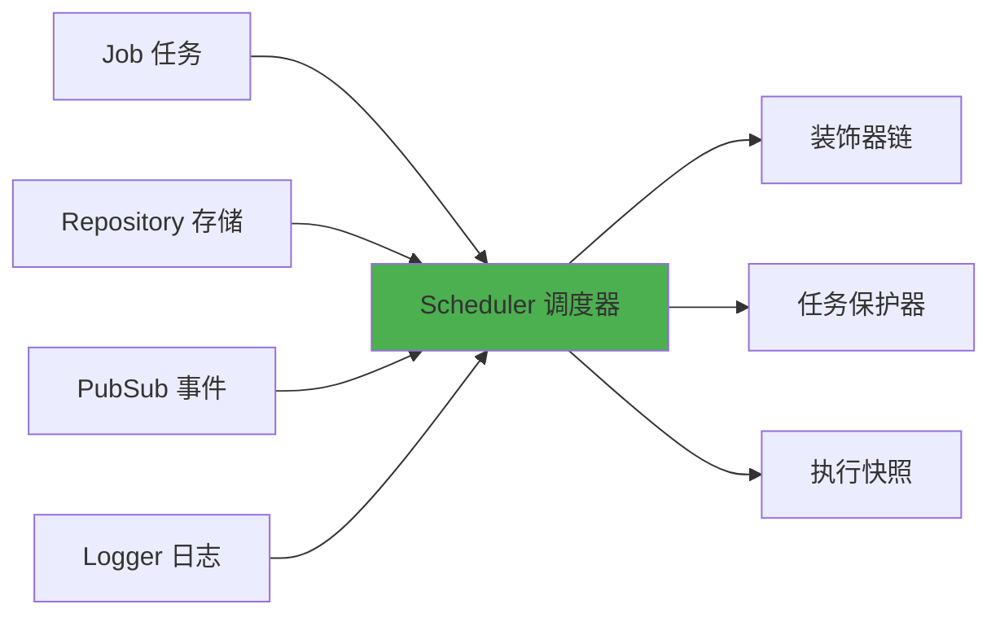
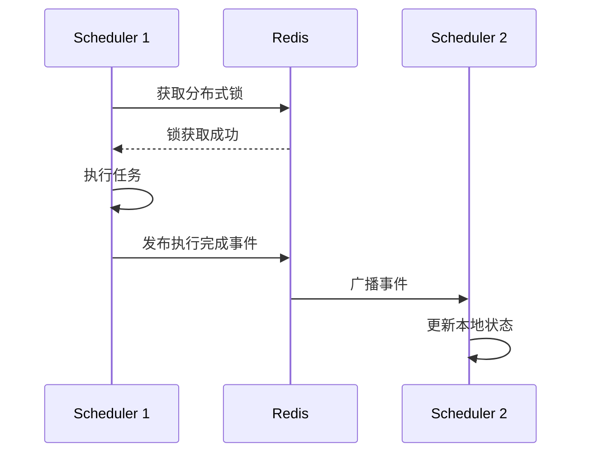
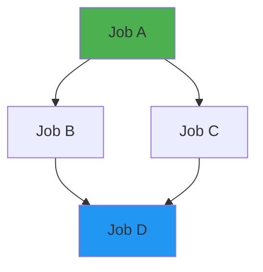
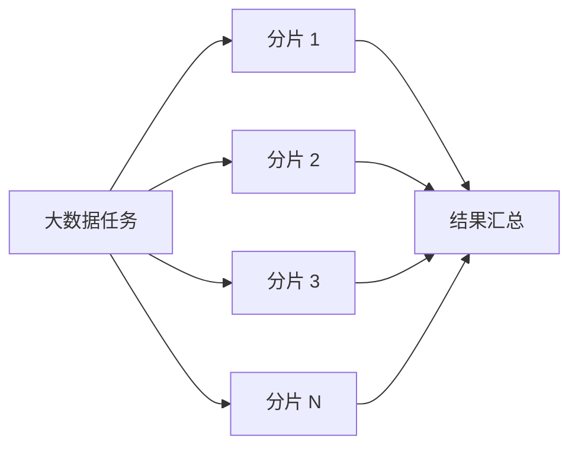

# go-scheduler

🚀 一个强大、灵活、可复用的 Go 任务调度框架，基于 robfig/cron/v3 构建

## ✨ 特性

### 核心功能

- 🕐 **Cron 表达式调度**：支持秒级精度的 Cron 表达式
- ⚡ **手动触发执行**：随时手动执行任何已注册的Job
- 📅 **定时执行**：XXL-JOB 风格的定时执行（指定时间+重复次数）
- 🔄 **任务补偿机制**：服务重启后自动补偿错过的任务
- 🔒 **重叠执行防止**：防止同一任务并发执行
- ⏱️ **超时控制**：支持任务执行超时设置
- 🔁 **自动重试**：任务失败后自动重试
- 📊 **执行记录追踪**：记录任务执行历史

### 架构特性

- 📦 **接口化设计**：所有组件都基于接口，易于扩展和测试
- 🗄️ **多存储后端**：支持内存、数据库（GORM）存储
- 🔴 **分布式就绪**：基于 Redis Pub/Sub 的分布式事件通知
- 🧩 **模块化**：job、repository、pubsub、logger 等模块独立可复用
- 🔌 **私有库集成**：使用 go-cachex、go-logger、go-toolbox等成熟组件

## 架构设计

### 整体架构



### 分布式架构



### 任务执行流程



### 事件驱动架构



## 快速开始

### 安装

```bash
go get github.com/kamalyes/go-scheduler
```

### 基础示例

```go
package main

import (
    "context"
    "fmt"
    
    "github.com/kamalyes/go-config/pkg/jobs"
    "github.com/kamalyes/go-scheduler/scheduler"
    "github.com/kamalyes/go-scheduler/job"
    "github.com/kamalyes/go-scheduler/pubsub"
)

// 1. 定义任务
type HelloJob struct {
    *job.BaseJob
}

func (j *HelloJob) Execute(ctx context.Context) error {
    fmt.Println("Hello, Scheduler!")
    return nil
}

func main() {
    // 2. 创建 PubSub
    ps := pubsub.NewLocalPubSub()
    defer ps.Close()
    
    // 3. 创建调度器
    sched := scheduler.NewCronScheduler(
        scheduler.WithPubSub(ps),
    )
    
    // 4. 注册任务
    sched.RegisterJob(&HelloJob{
        BaseJob: job.NewBaseJob("hello", "示例任务"),
    }, jobs.TaskCfg{
        CronSpec: "0 * * * * *", // 每分钟执行
        Enabled:  true,
    })
    
    // 5. 启动
    sched.Start()
    defer sched.Stop()
    
    select {}
}
```

更多示例请查看 [快速开始文档](./docs/QUICKSTART.md)。

## 核心概念

### 模块组成



### Job 接口

```go
type Job interface {
    Name() string                       // 任务唯一标识
    Description() string                // 任务描述  
    Execute(ctx context.Context) error // 执行逻辑
}
```

### 任务配置

```go
type TaskCfg struct {
    CronSpec       string   // Cron 表达式
    Enabled        bool     // 是否启用
    Timeout        int      // 超时（秒）
    MaxRetries     int      // 最大重试次数
    OverlapPrevent bool     // 防止重叠执行
    Dependencies   []string // 任务依赖
    Priority       int      // 优先级
}
```

详细说明请查看 [核心概念文档](./docs/CONCEPTS.md)。

## 高级特性

### 分布式调度



### 任务依赖 (DAG)



### 任务分片



更多高级特性请查看 [高级特性文档](./docs/ADVANCED.md)。

## 文档导航

📚 **完整文档**

- [快速开始](./docs/QUICKSTART.md) - 安装和基础使用
- [核心概念](./docs/CONCEPTS.md) - Job、Schedule、装饰器等
- [高级特性](./docs/ADVANCED.md) - 分布式、DAG、分片等
- [PubSub 使用](./PUBSUB_USAGE.md) - 事件系统详解
- [迁移指南](./MIGRATION_COMPLETE.md) - 从 cron/v3 迁移
- [Syncx 集成](./SYNCX_INTEGRATION.md) - go-toolbox 集成

## 技术栈

| 组件 | 说明 |
|------|------|
| **调度引擎** | 基于 `robfig/cron/v3` |
| **存储** | GORM (MySQL/PostgreSQL/SQLite) |
| **缓存** | Redis (go-cachex) |
| **事件** | Redis Pub/Sub |
| **日志** | go-logger |
| **工具** | go-toolbox (重试、熔断、队列等) |

## 项目结构

```
go-scheduler/
├── docs/              # 📚 文档目录
│   ├── QUICKSTART.md  # 快速开始
│   ├── CONCEPTS.md    # 核心概念
│   └── ADVANCED.md    # 高级特性
├── job/               # 🔧 任务接口和实现
├── scheduler/         # ⚙️  核心调度器
├── repository/        # 💾 存储层
├── pubsub/            # 📡 事件发布订阅
├── models/            # 📊 数据模型
└── logger/            # 📝 日志适配器
```

## 贡献

欢迎贡献代码、报告问题或提出建议！

## 许可证

MIT License - 详见 [LICENSE](./LICENSE) 文件
